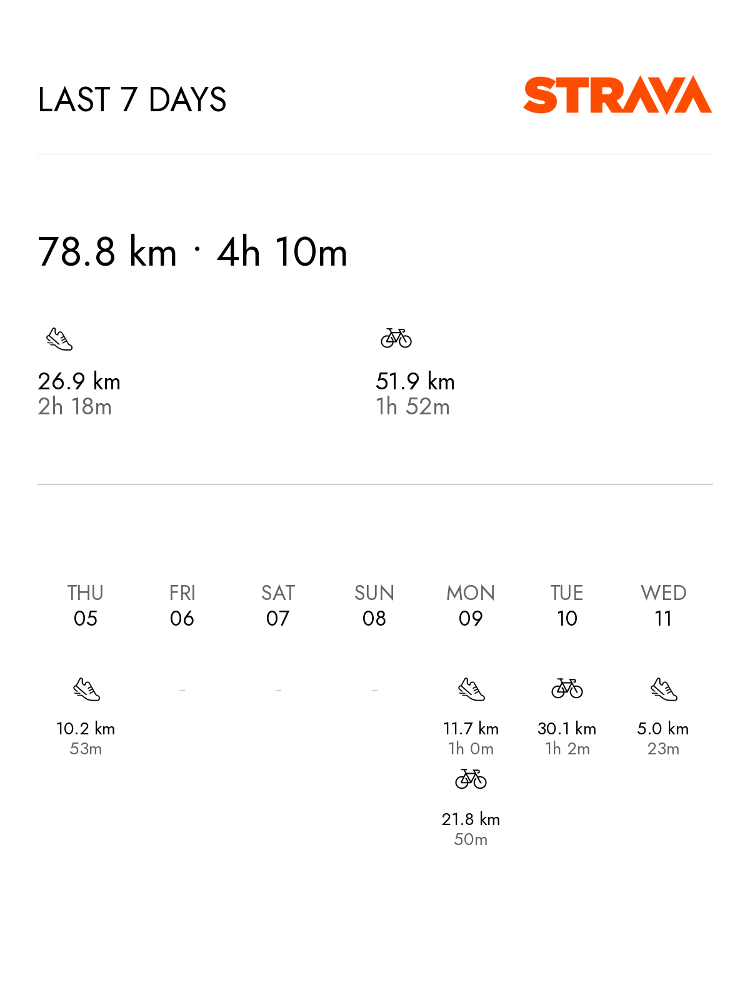

# InkyPi Strava Summary Plugin

A feature-rich plugin for [InkyPi](https://github.com/fatihak/InkyPi) that displays your Strava activity summaries on e-ink displays.
(Work in Progress)
## Features

✨ **Three Display Modes:**
- **Summary**: Aggregated totals with activity breakdown
- **Calendar**: 7-day visual calendar showing daily activities
- **Combined**: Summary stats + calendar in one view (default)

🏃 **Activity Tracking:**
- Running (Run, TrailRun, Treadmill)
- Cycling (Ride, VirtualRide, MountainBikeRide, GravelRide, EBikeRide)
- Swimming (Swim)
- Strength (WeightTraining, Workout, Crossfit)

📅 **Flexible Time Ranges:**
- Last N days (rolling window)
- Current week (Monday to today)

🔐 **Easy OAuth Setup:**
- One-click authorization in settings
- Automatic token refresh
- No manual token management needed

## Screenshot



## Installation

Install the plugin using the InkyPi CLI:

```bash
inkypi install strava_summary https://github.com/CobbleGen/InkyPi-Strava-Plugin
```

## Setup

### Step 1: Create a Strava API Application (Free)

1. Go to [https://www.strava.com/settings/api](https://www.strava.com/settings/api)
2. Click **"Create an App"**
3. Fill in the form:
   - **Application Name**: "InkyPi Display" (or your choice)
   - **Category**: Choose something appropriate
   - **Website**: Your InkyPi URL (`akz-inky.local`) 
   - **Authorization Callback Domain**: Your InkyPi domain (`akz-inky.local`)
4. Click **Create**
5. Note your **Client ID** and **Client Secret**

### Step 2: Configure the Plugin

1. In InkyPi, add the Strava Summary plugin
2. Go to plugin settings
3. Enter your **Client ID** and **Client Secret**
4. Click **"Authorize with Strava"**
5. Authorize the app on Strava's page
6. You'll be redirected back automatically

### Step 3: Choose Display Options

- **Display Mode**: Summary, Calendar, or Combined
- **Time Range**: Rolling days or Current week
- **Days to look back**: Set for rolling mode (default: 7)

That's it! The plugin will automatically refresh your data and handle token expiration.

## Display Examples

### Summary Mode
Shows total distance, time, and breakdown by activity type.

### Calendar Mode
Visual 7-day calendar with activity icons for each day.

### Combined Mode (Default)
Compact summary stats at the top with a weekly calendar below - the best of both worlds!

## Troubleshooting

**"Token expired and refresh failed"**
- Re-authorize in the settings page
- Check that your Client ID and Secret are correct

**"Cannot access activities (status 401)"**
- Your token doesn't have the required permissions
- Re-authorize using the settings page (it requests `activity:read_all` scope)

**"Authorization callback domain mismatch"**
- Ensure your Strava app's callback domain matches your InkyPi URL
- Common values: `localhost`, `akz-inky.local`), or your Pi's IP address

**No activities showing**
- Check that you have activities in the selected time period
- Verify the time range settings (rolling vs. current week)

## Local Preview

You can generate a preview image on your computer without needing the InkyPi hardware.

**Requirements:** Python 3 + `pip install pillow requests`

1. Create a `.env` file in the repo root (already gitignored). **Recommended — auto-refresh** so the token never expires:
   ```
   STRAVA_CLIENT_ID=your_client_id
   STRAVA_CLIENT_SECRET=your_client_secret
   STRAVA_REFRESH_TOKEN=your_refresh_token
   ```
   The script mints a fresh access token on each run and caches it back to `.env`.

   Get a refresh token (with `activity:read_all` scope) via the one-time OAuth flow:
   - Authorize in your browser (replace `CLIENT_ID`):
     ```
     https://www.strava.com/oauth/authorize?client_id=CLIENT_ID&response_type=code&redirect_uri=http://localhost&approval_prompt=force&scope=activity:read_all
     ```
   - After approving, copy the `code` value from the redirected `http://localhost/?...&code=XXXX&...` URL, then exchange it:
     ```bash
     curl -X POST https://www.strava.com/oauth/token \
       -d client_id=CLIENT_ID -d client_secret=CLIENT_SECRET \
       -d code=XXXX -d grant_type=authorization_code
     ```
   - Copy `refresh_token` from the JSON response into `.env`.

   <details><summary>Or use a single static token (simpler, but expires in 6 hours)</summary>

   ```
   STRAVA_ACCESS_TOKEN=your_access_token_here
   ```
   </details>

2. Run the preview script:
   ```bash
   # Calendar view (default)
   python preview.py

   # Other modes / options
   python preview.py --mode summary
   python preview.py --mode combined
   python preview.py --week               # current week instead of rolling days
   python preview.py --days 14            # last 14 days
   python preview.py --width 800 --height 480
   python preview.py --output my_preview.png --no-show
   ```

The image is saved as `preview.png` and opens automatically in your default image viewer.

## Activity Types

The plugin tracks these activity types:

**Running**: Run, TrailRun, Treadmill  
**Cycling**: Ride, VirtualRide, EBikeRide, MountainBikeRide, GravelRide  
**Swimming**: Swim  
**Strength / Other**: WeightTraining, Workout, Crossfit, Basketball, Cricket, Dance, Padel, PhysicalTherapy, Volleyball  

Other activity types are included in overall totals but not shown in sport-specific breakdowns.

## Technical Details

- **Language**: Python 3
- **Dependencies**: requests, Pillow (installed automatically)
- **API**: Strava API v3
- **Authentication**: OAuth 2.0 with automatic token refresh
- **Token Expiration**: Access tokens expire after 6 hours (auto-refreshed)

## License

This project is licensed under the MIT License - see the [LICENSE.md](LICENSE.md) file for details.

## Credits

Built for [InkyPi](https://github.com/fatihak/InkyPi) by the community.

Strava and the Strava logo are trademarks of Strava, Inc.
